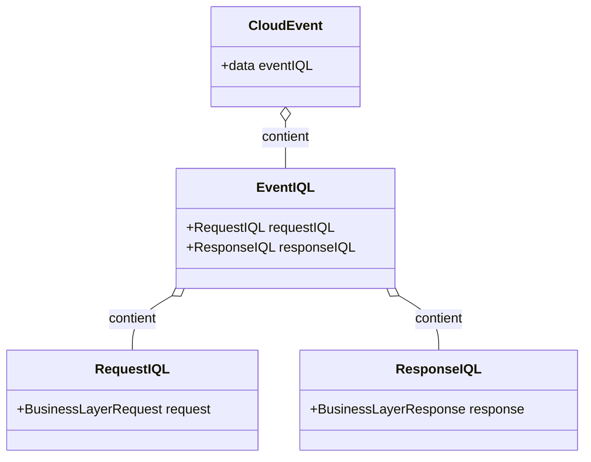

# API V2 Documentation - Table of Contents

- [1. Backend Evolution](#1-backend-evolution)
   - [1.1 TSOA](#11-tsoa)
   - [1.2 Roarr Logger](#12-roarr-logger)
   - [1.3 Middleware](#13-middleware)
- [2. Interface Query Language (IQL) Overview](#2-interface-query-language-iql-overview)
   - [2.1 Integration with TSOA](#21-integration-with-tsoa)
   - [2.2 Handling of REST and WebSocket Protocols](#22-handling-of-rest-and-websocket-protocols)
   - [2.3 GraphQL-style for Limited Depth Requests](#23-graphql-style-for-limited-depth-requests)
   - [2.4 Clear Separation of API Objects and Database](#24-clear-separation-of-api-objects-and-database)
   - [2.5 Design of the IQ Object](#25-design-of-the-iq-object)
   - [2.6 Error Management with LocalizeError](#26-error-management-with-localizeerror)
   - [2.7 Synthesis of Cost, Time, and Efficiency Gains with IQL](#27-synthesis-of-cost-time-and-efficiency-gains-with-iql)
- [3. File Structure and Types](#3-file-structure-and-types)
   - [3.1 Query Structure](#31-query-structure)
- [4. Understanding the Interface Query Language (IQL)](#4-understanding-the-interface-query-language-iql)
   - [4.1 CloudEvent Compatibility](#41-cloudevent-compatibility)
   - [4.2 EventIQL, RequestIQL, and ResponseIQL Layer](#42-eventiql-requestiql-and-responseiql-layer)
   - [4.3 Business Logic Layer](#43-business-logic-layer)
   - [4.4 Interface Query Language (IQL) - Detailed Structure](#44-interface-query-language-iql---detailed-structure)
- [5. Examples objets](#5-examples-objects)
   - [5.1. Business Layer Structure - "Team" Example](#51-business-layer-structure---team-example)
   - [5.2. User Example with IQL](#52-user-example-with-iql)
      - [5.2.1 User API Request Object Breakdown for User Search](#521-user-api-request-object-breakdown-for-user-search)
      - [5.2.2 Backend Response for User Search](#522-backend-response-for-user-search)
   - [5.3. Login Example](#53-login-example)

# 1. Backend Evolution

## 1.1 TSOA

TSOA is a framework used for building REST APIs in Node.js with TypeScript. It facilitates automatic routing and API
documentation generation. By defining controllers and models using decorators, TSOA automatically generates
Swagger-compatible API documentation, ensuring that the documentation always matches the actual API implementation.

## 1.2 Roarr Logger

Roarr is a JSON logger ideal for Node.js applications. It's lightweight and provides a structured approach to logging,
making it easier to analyze logs. Roarr allows for conditional logging, enabling developers to adjust log levels without
code changes, and supports context logging to maintain the traceability of logs through different parts of the
application.

## 1.3 Middleware

Middleware in this API handles tasks like request parsing, logging, error handling, and security checks. They act as a
series of functions that get executed in the order they are introduced into the application. This section explains each
middleware's purpose and how they contribute to processing requests and responses in the API.

# 2. Interface Query Language (IQL) Overview

The Interface Query Language (IQL) represents a strategic and technological innovation for developers working with REST,
WebSocket protocols, and a GraphQL-inspired approach. Designed to simplify, standardize, and secure the management of
requests and responses in backend applications, IQL aims to optimize development, flexibility, performance, and
stability, while being adaptable for multilingual use.

2.1 **Integration with TSOA for Standardization and Documentation**
IQL utilizes TSOA to automate two crucial aspects of software development: data validation and documentation creation.
This means that every piece of information processed by IQL is systematically checked for compliance, reducing common
errors and improving system reliability. Simultaneously, API documentation is generated and updated automatically,
accelerating the development process with clear, up-to-date information and enabling the creation of ready-to-use client
libraries. This ensures perfect consistency between our API and the tools developers use to access it.
*Goals: Critical process automation*
*Benefits: Error reduction, development time savings, constantly updated documentation*

2.2 **Handling of REST and WebSocket Protocols**
IQL harmonizes the management of REST and WebSocket protocols, offering unprecedented flexibility for standard
operations and real-time interactions. This ability to simultaneously handle REST requests, ideal for standard
operations, and WebSocket, perfect for live responsiveness like push notifications or chats, optimizes the efficiency of
our communication architecture. By integrating an interface compatible with these two protocols, IQL not only speeds up
future development but also ensures that all code is interoperable. This significantly reduces workload, practically
doubling the efficiency of our development efforts for real-time needs.

2.3 **Use of a GraphQL-style for Limited Depth Requests**
IQL integrates a GraphQL-inspired approach for requests, offering limited depth that simplifies the retrieval of complex
data. This method reduces network load, enhances efficiency, and optimizes developer experience, while lightening the
server load to maintain high performance. This innovative design allows greater flexibility for unforeseen needs without
sacrificing quality, giving developers more autonomy to solve problems. By reducing the dependency of teams on each
other, IQL increases the overall development velocity in the long term.

2.4 **Clear Separation of API Objects and Database**
IQL establishes a clear separation between API business logic and database interactions, enhancing modularity and
facilitating maintenance and application evolution. This distinction ensures better data protection and reduces security
breach risks. In the current context where the front-end, API, and database are closely linked, a change in the database
structure can have costly repercussions across all environments, including iOS, Android, and Web, and it's often complex
to anticipate all risks and impacts. The separation provided by IQL creates a stable interface contract that allows
changes with more flexibility and fewer unforeseen repercussions, thus offering an additional layer of protection and
greater freedom in development.

2.5 **Design of the IQ Object: Analogous Functioning to IP Packets**
The IQ object, central to IQL, draws inspiration from IP packets to standardize request and response management. This
approach ensures increased flexibility and reliability in data processing, thereby facilitating their tracking,
auditing, and asynchronous operation management. In addition to its robustness and versatility for complex tasks, the IQ
object stands out for its ability to be used in multiple ways. Firstly, the IQ object can be consumed via APIs using
either REST or WebSocket protocols, thus offering extended interoperability and real-time communication. Additionally,
it has the unique ability to be put on hold, similar to a task in Redis, and executed later. This feature allows
efficient resource management and optimal task planning, offering the possibility to defer operations that do not
require immediate execution.

2.6 **Error Management with LocalizeError and Native Translation**
IQL adopts an innovative method for error management with LocalizeError, a system that presents error messages in the
users' native language. This approach makes errors more understandable and accessible, thus improving the overall user
experience. For developers, it simplifies debugging by providing clear and relevant error messages and supports
maintaining a truly multilingual API. Ultimately, LocalizeError adds an extra dimension to the convenience and
effectiveness of our API, making technical interactions smoother and more intuitive.

## 2.7 Synthesis of Cost, Time, and Efficiency Gains with IQL

IQL brings notable improvements in terms of cost, time, and efficiency, particularly in the human context:

- **Reduction in Development Costs:** Automating validation and documentation through TSOA, along with standardizing
  requests via a GraphQL style, minimizes manual coding and maintenance needs. This translates into a significant
  decrease in development costs.
- **Time Savings for Teams:** By eliminating the need to manually write and update documentation, and by reducing
  repetitive tasks through the unified management of REST and WebSocket protocols, IQL frees up valuable time for teams.
  Developers can then focus on value-added tasks.
- **Operational Efficiency:** The clear separation between API business logic and database interactions eases
  maintenance and change management, thus reducing the risks of errors and delays due to structural changes.
- **Improved Productivity:** The design of

the IQ object, inspired by IP packets, offers flexible and robust data management, enabling developers to efficiently
handle complex tasks. This speeds up development processes and boosts overall productivity.

- **Communication Optimization:** Error management with LocalizeError improves end-users' understanding, reducing the
  need for technical support and enhancing user experience, which translates into better satisfaction and a reduction in
  customer service-related costs.

### Conclusion

IQL represents a significant advancement in backend application development, innovatively combining REST and WebSocket
protocols with a GraphQL-inspired approach. Through its six key aspects:

- Automated standardization and documentation integration with TSOA.
- Unified management of REST and WebSocket protocols for optimal flexibility and responsiveness.
- Use of a GraphQL-style for limited depth requests for enhanced efficiency.
- Clear separation between API objects and the database for better security and ease of maintenance.
- Design of the IQ object, drawing inspiration from IP packets for versatile data management.
- Error management with LocalizeError for improved accessibility and understanding at the international level.

IQL stands as a comprehensive solution, offering substantial benefits for both developers and end-users. Its capability
to automate essential processes, unify various communication protocols, and enhance user experience with multilingual
features makes it an indispensable tool in the modern landscape of software development. In summary, IQL is not just a
step forward in API management technology but also a significant leap in creating smarter, faster, and more intuitive
applications.

# 3. File Structure and Types

# 3.1 Query Structure

#### Request Analysis

Each API request is processed following a structured approach:

```
.
├── corenexus
│ ├── IQ.md
│ └── README.md
├── index.ts
├── middlewares
│ ├── authentification.ts
│ ├── errorHandler.ts
│ └── initHandler.ts
├── resources
│ ├── HOW_TO.md
│ └── team
│     ├── team.assertion.test.ts
│     ├── team.controller.ts
│     ├── team.db.test.ts
│     ├── team.db.ts
│     ├── team.resource.test.ts
│     ├── team.resources.ts
│     └── team.types.ts
```

##### `team.types.ts`

This file contains all typings specific to the 'team' resource. It includes interfaces and types that define the shape
of team objects, requests, and responses. Centralizing these types ensures consistency across various modules handling
team data.

##### `team.controller.ts` (Documentation with TSOA)

The controller handles API routes and integrates with TSOA for documentation. Here, each route is defined with TSOA
decorators that describe the endpoint, expected request, and response structure, automatically generating up-to-date API
documentation.

##### `team.resource.ts` (Business Logic with IQL)

1. **First Step: Advanced Search**
   Implementing advanced search logic to process the query parameters. This involves interpreting the parameters to form
   a query that fetches the necessary IDs from the database.

##### `team.db.ts` (SQL Logic with Prisma)

Focuses on the database interaction using Prisma. Prisma is used as an ORM (Object-Relational Mapping) tool, simplifying
database queries and transactions. This file contains the SQL queries and logic needed to fetch and manipulate data from
the database.

##### `team.resource.ts`

2. **Second Step: Object Construction**
   After fetching the necessary data, this step involves constructing the response object in a format compliant with the
   API's specification. This includes formatting, data aggregation, and applying business rules.

### Testing Extensions

#### `team.db.test.ts`

Database testing is crucial for ensuring data integrity and performance. These tests cover various scenarios, including
query accuracy, response time, and error handling.

#### `team.assertion.test.ts`

These tests focus on resource validation, ensuring that the API responses meet the defined schemas and business rules.
They are critical for verifying the API's

# 4. Understanding the Interface Query Language (IQL)

IQL operates on three primary layers, each contributing to its comprehensive functionality:



## 4.1 CloudEvent Compatibility

- **Purpose:** Ensures compatibility with the CloudEvent format, providing a standardized approach for event-driven
  architectures.
- **Data Storage:** All data is contained within the "data" field of a CloudEvent.

## 4.2 EventIQL, RequestIQL, and ResponseIQL Layer

This layer forms the core of IQL's request-response handling mechanism:

### EventIQL Structure

EventIQL is composed of three main parts:

1. **Event:** Represents the specific occurrence or action that initiates the IQL process.
2. **RequestIQL Object:** Contains the query or request details made by the client.
3. **ResponseIQL Object:** Holds the response data to be sent back to the client.

### RequestIQL Object

- **Search Filters:** Enable precise and targeted queries for data retrieval.
- **"Extend" Configuration:** Similar to GraphQL, this allows expansion of objects based on a schema, utilizing "build"
  & "builds" constructors.

### ResponseIQL Object

- **Expected Objects and Pagination:** Structures the response, including pagination, to deliver data in the desired
  format and quantity.

## 4.3 Business Logic Layer

The third layer is dedicated to the business logic of users. It involves custom objects and operations specific to each
event, integrated within the RequestIQL and ResponseIQL structures. This layer allows for the implementation of
business-specific rules and data processing, enabling tailored solutions for different use cases.

- **Custom Business Logic:**
   - `request`: Contains custom request data tailored to specific business needs.
   - `response`: Custom response data structured according to the requirements of each business scenario.

## Summary

IQL's layered architecture, with CloudEvent compatibility in the first layer and the core request-response mechanism in
the second layer (EventIQL, RequestIQL, ResponseIQL), provides a robust and flexible framework for API interactions. The
third layer, dedicated to business logic, allows for customized data handling, making IQL a powerful tool in modern API
development.

## 4.4 Interface Query Language (IQL) - Detailed Structure

## 1. CloudEvent Layer (EventIQL)

EventIQL is structured as a CloudEvent, which is essential for compatibility and standardization. Key components
include:

- `EventIQL<DataIQL>`: Core structure of EventIQL, containing essential fields:
   - `id`: Unique identifier for each event.
   - `type`: `ResponseTypeIQL` Describes the event type, useful for routing and policy enforcement.
   - `source`: `ApiNetworkOrigin` Identifies the context of the event. Combines `ApiOrigin` and `ApiNetwork` for a comprehensive
     identifier.
      - `ApiNetwork`: Defines the network used to transport the IQ (e.g., REST, SOCKET).
      - `ApiOrigin`: Indicates the origin of the IQ creation (e.g., WEB, MOBILE, BACKEND).
   - `subject`: `EventIQL` : EventName = Further describes the event subject within the producer's context.
   - `datacontenttype`: Indicates the content type of the data (e.g., application/json).
   - `time?`: Timestamp of event creation.
   - `dataschema?`: Optional schema defining the data structure.
   - `specversion`: Specifies the CloudEvent specification version.
   - `data`: The main payload of the event.
   - `data_base64?`: Optional field for binary data.

## 2. RequestIQL and ResponseIQL Layer

This layer focuses on standardizing the handling of requests and responses in REST and SOCKET networks:

### RequestIQL<Request, Response>

- `version`: Client API version.
- `request`: Actual request data.
- `source`: Source origin of the request.

### ResponseIQL<Request, Response>

- Inherits from `RequestIQL`.
- `status`: HTTP code indicating the response status.
- `success`: Boolean status of the IQ.
- `message`: Developer message for debugging.
- `translations`: ApiLocalized messages for user display.
- `response`: The response data.
- `error`: Additional error information, including type and data.

## 3. Business Data Layer

This layer involves custom objects specific to each EVENT, contained in:

- `request`: Custom request data tailored to the specific needs of the event.
- `response`: Custom response data formatted according to the event requirements.

Each event type can define its own structure for `request` and `response`, allowing for flexibility and specificity in
handling different types of interactions within the IQL framework.

---

In summary, IQL's three-layer architecture provides a comprehensive, flexible, and standardized way of handling events,
requests, and responses across different network types and communication protocols. This structure ensures consistency,
security, and ease of development in backend applications.

```mermaid
classDiagram
    class CloudEvent {
        +String id
        +ResponseTypeIQL type
        +ApiNetworkOrigin source
        +String subject
        +String datacontenttype
        +String time?
        +String dataschema?
        +String specversion
        +DataIQL data
        +String data_base64?
    }
    class EventIQL {
        +String event
        +RequestIQL requestIQL
        +ResponseIQL responseIQL
    }
    class RequestIQL {
        +String version
        +BusinessDataRequest request
        +String source
    }
    class ResponseIQL {
        +RequestIQL requestIQL
        +int status
        +boolean success
        +String message
        +ApiLocalized translations
        +BusinessDataRequest request
        +ErrorInformation error
    }

    CloudEvent o-- EventIQL: contient
    EventIQL o-- RequestIQL: contient
    EventIQL o-- ResponseIQL: contient
````

# 5. Examples objets

## 5.1 Business Layer structure - "Team" Example

The "Team" object in IQL is an exemplar of the system's approach to data structuring and extension. It follows a
specific pattern that enhances data retrieval and customization.

## 1. BaseObject-Based Structure

- **Definition:** The `Team` object is based on the `BaseObject` structure, providing a standardized foundation.
- **Purpose:** This approach ensures consistency across different types of objects within the API.

## 2. Expandable Objects for Data Exploration

- **Expandable Objects:** `Team` includes `Expandable` objects like `company`, `department`, and `users`.
- **Functionality:** These objects allow for exploration and extension of related data, providing a flexible and
  detailed data retrieval process.

## 3. Extension Types and Configuration

- **Extension Types (`TeamExtension`):** Defines the possible extensions for the `Team` object, such as `id` or the
  full `Team` object.
- **Extension Type Definitions (`TeamExtensionTypes`):** Describes the structure of each extension type, enabling
  precise and tailored data representation.

## 4. Expandable Object Usage

- **Role of Expandable Objects:** Expandable objects represent the possibilities for extending a `Team` object.
- **Application:** Used in the `build` function to create objects for the `response` section in `ResponseIQL`, ensuring
  the response is customized to the client's requirements.

## 5. Extension Configuration Objects

- **Extension Configuration (`TeamExtensionConfiguration`):** A configuration object for extending `Team`.
- **Usage in Requests:** Utilized in front-end `Request` objects to personalize the data retrieval experience. It allows
  clients to specify which aspects of the `Team` data they want to expand.

## 6. EventIQL Objects for API Requests and Responses

- **EventIQL for Requests (`TeamRetrieveRequestIQL`):** Describes the structure for API requests to retrieve a `Team`,
  including its extendable aspects.
- **EventIQL for Responses (`TeamRetrieveResponseIQL`):** Defines how the response for a `Team` retrieval request is
  structured, ensuring it aligns with the client's specified extensions.

# Structure Business Layer - Exemple "Team"

Le diagramme de classes suivant illustre la structure et la composition de l'objet "Team" dans IQL :

```mermaid
classDiagram
    class EventIQL {
        +String id
        +String type
        +ApiNetworkOrigin source
        +String subject
        +String datacontenttype
        +String specversion
        +Object data
    }
    class RequestIQL {
        +TeamRetrieve request
    }
    class ResponseIQL {
        +TeamResponse response
    }
    class TeamRetrieve {
        +int team_id
        +TeamExtensionConfiguration extend
    }
    class TeamResponse {
        +Array~TeamExpandable~ teams
        +PaginationDetails pagination
    }
    class TeamExpandable
    class TeamExtensionConfiguration {
        +TeamExtension config
        +CompanyExtensionConfiguration company
        +DepartmentExtensionConfiguration department
        +UserExtensionConfiguration users
    }
    class PaginationDetails {
        +int page
        +int pageSize
        +int pageTotal
        +int count
    }

    EventIQL "1" --o "1" RequestIQL: contains
    EventIQL "1" --o "1" ResponseIQL: contains
    RequestIQL "1" --o "1" TeamRetrieve: requestDetails
    ResponseIQL "1" --o "1" TeamResponse: responseDetails
    TeamRetrieve "1" --o "1" TeamExtensionConfiguration: extensionConfig
    TeamResponse "1" --o "*" TeamExpandable: teams
    TeamResponse "1" --o "1" PaginationDetails: pagination
```

## Summary

The "Team" object in IQL demonstrates a sophisticated approach to API data structuring. Through its BaseObject
foundation, expandable objects, extension types and configurations, and the use of EventIQL objects, IQL provides a
highly flexible and customizable system. This system allows for detailed and tailored data retrieval, catering to
specific client needs and enhancing the overall API experience.

## 5.1 User example with IQL

This section explains the user management features within our API using the Interface Query Language (IQL).

## Overview

Our API utilizes IQL for flexible and detailed user data retrieval and management. This includes handling both public
and private user data, with customizable extension configurations.

## Key Components

- **UserPublic and UserPrivate**: Extend from `BaseObject` and represent different levels of user information exposure.
- **UserExpandable**: A flexible type that can represent either a user ID or a full user object (public or private).
- **UserExtension and UserExtensionConfiguration**: Allow for the customization of the user data structure in API
  responses.
- **Permissions**: Enumerates various access levels within the application, ranging from `NO_RIGHT` to `SUPER_ADMIN`.
- **Configurations**: Additional settings for users, like language preferences and notification settings.

## IQL for User Retrieval

- **UserRetrieveRequestIQL and UserRetrieveResponseIQL**: Handle requests and responses for retrieving specific user
  details.
- **UserRetrievesRequestIQL and UserRetrievesResponseIQL**: Used for retrieving a list of users.

## User Search Functionality

- **search**: A method that uses `UserSearchRequestIQL` for user search queries and returns `UsersSearchResponseIQL`.
- **Customization**: Allows for personalized user searches based on parameters like name, teams, and extend options.

# User API Request Object Breakdown for User Search

This document provides a detailed explanation of the API request object for user search, demonstrating the interaction
of the Interface Query Language (IQL) layers.

### 5.2.1 API Request Object with Layer Annotations

```
{
    "id": "1", // CloudEvent: Unique event identifier
    "type": "REPLY_TO_SOURCE", // CloudEvent: Response type indicating where the response should be sent
    "datacontenttype": "application/json", // CloudEvent: Format of the data (JSON in this case)
    "specversion": "1.0", // CloudEvent: Specification version of the CloudEvent
    "subject": "USER_SEARCH", // EventIQL: Type of the event, here it's a user search
    "data": {
        "request": {
            "name": "", // RequestIQL: Search parameter (name of the user)
            "teams": [4], // RequestIQL: Search parameter (team IDs)
            "sort": "asc", // RequestIQL: Sorting order of the search results
            "pagination": { // RequestIQL: Pagination details for the search results
                "page": 1,  // Page number navigated to
                "pageSize": 100 // Number of results per page
            },
            "extend": { // RequestIQL: Configuration for data expansion in the response
                "config": "UserPublic", // UserExtensionConfiguration: Defines the extension level for user data
                "teams": {
                    "config": "id" // TeamExtensionConfiguration: Specifies that only team IDs should be returned
                }
            }
        }
    }
}
```

## Explanation

- CloudEvent Layer: This layer provides the foundational structure of the event, including unique identification,
  response type, data format, and the event specification version.
- EventIQL Layer: It specifies the particular event within the application, which in this instance is USER_SEARCH.
- RequestIQL Layer: This layer details the specific request parameters and configurations, such as search criteria,
  sorting, pagination, and data expansion preferences.

## 5.2.2 Backend Response for User Search

### Response Object Breakdown with IQL Layers

```
{
    "datacontenttype": "application/json", // CloudEvent: Format of the data
    "id": "1", // CloudEvent: Unique event identifier
    "source": "WEB:REST", // CloudEvent: Source of the event (WEB via REST API)
    "specversion": "1.0", // CloudEvent: CloudEvent specification version
    "subject": "USER_SEARCH", // EventIQL: Event type indicating a user search
    "type": "REPLY_TO_SOURCE", // CloudEvent: Response behavior (reply to the source)
    "data": {
        "request": { ... }, // RequestIQL: Echo of the original request data
        "success": true, // ResponseIQL: Indicates successful processing of the request
        "status": 200, // ResponseIQL: HTTP status code of the response
        "message": "OK", // ResponseIQL: Status message
        "translations": { ... }, // ResponseIQL: ApiLocalized response messages
        "response": { // ResponseIQL: The main response data containing user details
            "users": [
                // Array of user objects (UserPublic) based on the 'extend' configuration in the request
                // Each object contains user details like id, email, first_name, etc.
                // Included fields are determined by the 'UserPublic' extension configuration
                {
                    "id": 419,
                    "object": "UserPublic",
                    "email": "itzel.corona@armtek.fr",
                    // Other user fields...
                    "teams": [4, 8, 12, 1, 3, 63], // Teams array as per 'teams' extension configuration
                    "company": 1
                },
                // Additional user objects...
            ],
            "pagination": { // Pagination details for the response
                "page": 1,
                "pageSize": 100,
                "pageTotal": 1,
                "count": 8
            }
        }
    }
}
```

### Layer Explanation

- CloudEvent Layer: Includes metadata about the event, such as its format, ID, source, specification version, and type.
- EventIQL Layer: Specifies the event type (USER_SEARCH), linking the response to the corresponding request event in the
  system.
- ResponseIQL Layer: Contains the actual response to the request, including the success status, HTTP status code, status
  message, any translations, and the main response payload (response object).
- Response Payload: The response object within the data field includes the actual data being returned - in this case, an
  array of UserPublic objects and pagination details. This part of the response directly reflects the extend
  configuration from the request, showing how the data was tailored according to the request parameters.

## 5.3. Login Example

This example documents the authentication flow leveraged by IQL when a client performs a login action. The request and
response both reuse the CloudEvent envelope while relying on the `NetworkIQL`, `RequestIQL` and `ResponseIQL` building
blocks.

### Login Request Object

```
{
    "id": "01HY2S06TR00M6PFZP8GRPJC6D", // CloudEvent: ULID generated for traceability
    "source": "WEB:REST",               // CloudEvent: Origin of the event
    "type": "REPLY_TO_SOURCE",          // CloudEvent: Response should follow the original channel
    "subject": "ACTION_LOGIN",          // EventIQL: Identifies the authentication action
    "dataschema": "login",              // EventIQL: Schema reference used server-side
    "datacontenttype": "application/json",
    "specversion": "1.0",
    "data": {
        "version": "1",                 // NetworkIQL: Versioning for compatibility
        "event": "ACTION_LOGIN",        // NetworkIQL: Mirrors the subject for routing
        "request": {                    // RequestIQL<Login>
            "email": "user@example.com",
            "password": "secret"
        }
    }
}
```

### Successful Login Response

```
{
    "id": "01HY2S06TR00M6PFZP8GRPJC6D",
    "source": "WEB:REST",
    "type": "REPLY_TO_SOURCE",
    "subject": "ACTION_LOGIN",
    "dataschema": "login",
    "datacontenttype": "application/json",
    "specversion": "1.0",
    "data": {
        "version": "1",
        "event": "ACTION_LOGIN",
        "request": {
            "email": "user@example.com",
            "password": "secret"
        },
        "success": true,
        "status": 201,                  // ApiHttpCode.Created
        "message": "Created",
        "translations": {
            "code": "AUTH_LOGIN_SUCCESS",
            "messages": {
                "en": "Access granted.",
                "fr": "Connexion réussie."
            }
        },
        "response": {                   // ResponseIQL<Login, LoginSuccess>
            "accessToken": "jwt-access-token",
            "refreshToken": "jwt-refresh-token"
        }
    }
}
```

### Failure Handling

When credentials are invalid, the server returns the same envelope with `success` set to `false`, `status` typically
mapped to `ApiHttpCode.Unauthorized (401)`, and a localized error message such as the one defined in
`src/common/MessageCodes.ts:79`. Consumers should rely on the `translations` field to present the error in the user's
preferred language.
